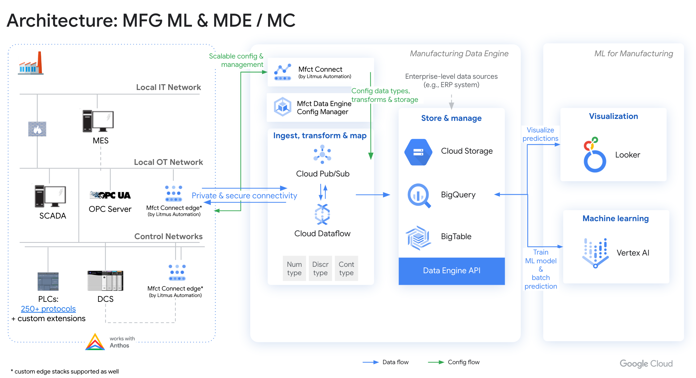

# Machine Learning for Manufacturing

Machine Learning for Manufacturing (MFG ML) is a end-to-end
solution accelerator that builds and
deploys a machine learning model for tool wear detection using
[Manufacturing Data Engine](https://cloud.google.com/solutions/manufacturing-data-engine)
and [Vertex AI](https://cloud.google.com/vertex-ai).

## Architecture

The Machine Learning for Manufacturing solution accelerator
includes the following components:

1. [Manufacturing Connect and Manufacturing Connect edge]((https://cloud.google.com/solutions/manufacturing-data-engine))
    - Factory edge platform co-developed with Litmus Automation
    that connects to manufacturing assets and streams the asset telemetries to
    Manufacturing Data Engine.

1. [Manufacturing Data Engine](https://cloud.google.com/solutions/manufacturing-data-engine)

    - [Pub/Sub](https://cloud.google.com/pubsub): message broker for
    factory telemetries and integration point for factory edge platform and MDE.
    - [Dataflow](https://cloud.google.com/dataflow): fully managed and unified
    stream and batch data processing pipeline.
    - [Cloud Storage](https://cloud.google.com/storage): object storage for
    structured and unstructured factory data.
    - [BigQuery](https://cloud.google.com/bigquery): serverless data
    warehouse for storing structured and semi-structured factory data.
    - [Cloud Bigtable](https://cloud.google.com/bigtable): fully managed NoSQL
    database optimized for storing factory time series data.

1. [Vertex AI](https://cloud.google.com/vertex-ai)
    - Unified AI platform for building and deploying machine learning models.

1. [Looker](https://www.looker.com/)
    - Business intelligence platform optimized for Google Cloud integration.

## Deployment

For instructions to deploy this solution accelerator, please see
[deployment.md](./docs/deployment.md).
