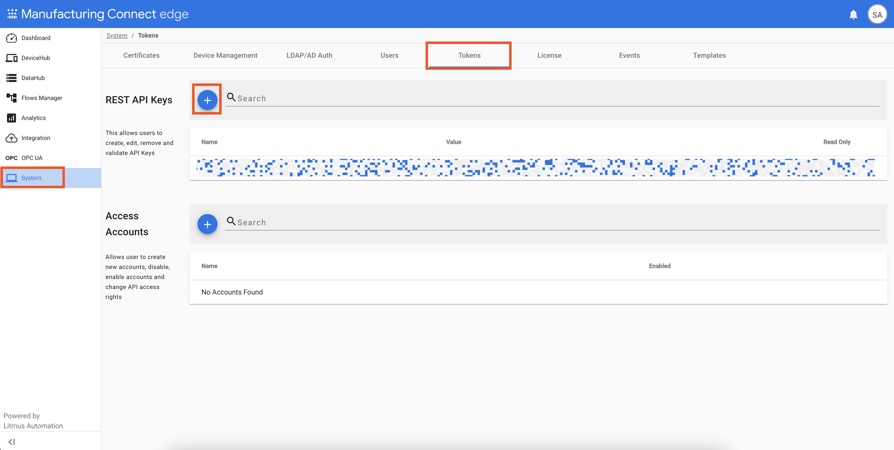

# Deployment Guide

This document describe the steps for deploying ML4M in a
[Manufacturing Data Engine (MDE)](https://cloud.google.com/solutions/manufacturing-data-engine)
environment.

## Prerequisites

1. A MDE environment
   - Refer to MDE Deployment Guide for instructions on deploying MDE.
   - Network access to MDE Config Manager is required.
   - Please work with your Google Cloud representative to create
     a MDE environment.

## Instructions

### MDE and MCe

1. Copy [/tools/.env.example](/tools/.env.example) into `/tools/.env`
   and update the environment variable values.
    - To obtain MCe API token, you can create an API token through your MCe
      instances. After you obtain the API token, you will have to base64
      encode the API token with an appended `:`. For example, if your API
      token is `kf6kf3`, you will base64 encode `kf6kf3:` (notice the extra
      `:` at the end) and obtain `a2Y2a2YzOgo=` as the result. Then, you will
      use `a2Y2a2YzOgo=` in your `.env` file.
    
    - To obtain MCe Pub/Sub connector id, you can get it from the "Integration"
      section in your MCe instance.
    

1. (Optional) Start a SSH tunnel to the [Google Compute Engine](https://cloud.google.com/compute)
   proxy instance as instructed in the MDE Deployment Guide.
    - If you have [Cloud Interconnect](https://cloud.google.com/network-connectivity/docs/interconnect)
      with your GCP environment, you can skip this step.

1. From the `/tools` directory, run `deploy.sh`.

### Vertex AI

TODO

### Looker

TODO
