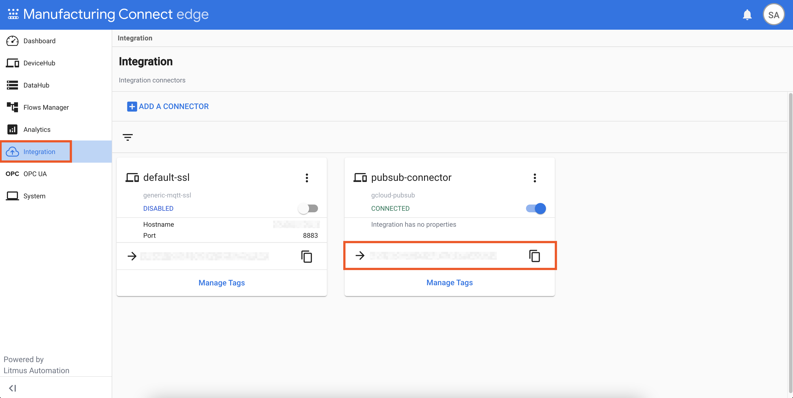
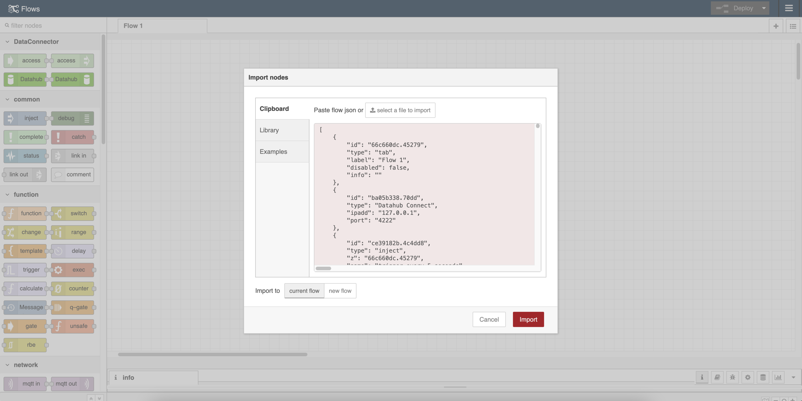
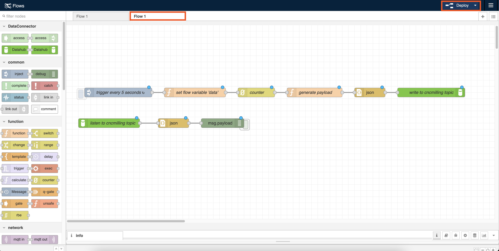

# Deployment Guide

This document describe the steps for deploying MFG ML in a
[Manufacturing Data Engine (MDE)](https://cloud.google.com/solutions/manufacturing-data-engine)
environment.

## Prerequisites

1. A MDE & MC & MCe environment with the latest version.
   - Refer to MDE Deployment Guide for instructions on deploying MDE.
   - Network access to MDE Config Manager is required.
   - Please work with your Google Cloud representative to create
     a MDE environment.

## Instructions

### MDE and MCe

1. Copy [/tools/.env.example](/tools/.env.example) into `/tools/.env`
   and update the environment variable values.
    - To obtain MCe API token, you can create an API token through your MCe
      instances. After you obtain the API token, you will have to base64
      encode the API token with an appended `:`. For example, if your API
      token is `kf6kf3`, you will base64 encode `kf6kf3:` (notice the extra
      `:` at the end) and obtain `a2Y2a2YzOgo=` as the result. Then, you will
      use `a2Y2a2YzOgo=` in your `.env` file.

      > You can use the command to base64 encode the API token
        `echo -n "<MCE_API_TOKEN>" | base64`

    
    - To obtain MCe Pub/Sub connector id, you can get it from the "Integration"
      section in your MCe instance.
    

1. (Optional) Start a SSH tunnel to the [Google Compute Engine](https://cloud.google.com/compute)
   proxy instance as instructed in the MDE Deployment Guide.
    - If you have [Cloud Interconnect](https://cloud.google.com/network-connectivity/docs/interconnect)
      with your GCP environment, you can skip this step.

1. From the `/tools` directory, run `deploy.sh`.
    - This will configure MDE and MCe for ML4M.

1. Import pre-defined flow into your MCe instance.
    - Navigate to MCe UI and select "Flow Manager" on the sidebar.
    - Click the "Go To Flow Definition" button for "flow-1".
      "flow-1" should be automatically created when you deploy MCe.
    - In Node-RED UI, expand the hamburger button in the upper right
      corner. Select "Import".
    - In the popup window, click on the "select a file to import" button and
      locate the [flow definition](/mce/flows/flow-data-generation.json) on
      your filesystem. Leave other settings as default and click "Import".
    
    - You should see the imported flow in a new tab within the Node-RED UI.
      Navigate to the imported flow tab and click "Deploy" in the upper right
      corner.
    

#### Verify MDE and MCe Setup

After MDE and MCe are configured, you should see data flowing into BigQuery.
You can verify the data stream with the following BigQuery query:

```sql
SELECT
  *
FROM
  `sfp_data.NumericDataSeries`
WHERE
  DATE(eventTimestamp) >= CURRENT_DATE()
  AND STARTS_WITH(tagName, 'cncmilling')
ORDER BY
  eventTimestamp DESC
LIMIT
  1;
```

If MDE and MCe configurations succeed, you should see 1 row with non-empty
payload, payload qualifier, and metadata.

### Vertex AI

For this part, you will create a notebook instance in
[Vertex AI Workbench](https://cloud.google.com/vertex-ai/docs/workbench/introduction)
and train & deploy AutoML models in Jupyter notebooks.

1. Navigate to [Vertex AI Workbench](https://console.cloud.google.com/vertex-ai/workbench/legacy-instances).
    - If this is your first time using Vertex AI, you will need to enable
      Vertex AI and Notebooks API before proceeding.

1. Create a new managed notebook.
    - Change the notebook instance name and region to your preferred name
      and region. Leave all other settings as their default values.

1. It should take 2-5 minutes for the notebook instance to provision. Once
   the instance is active, click "OPEN JUPYTERLAB" to open the notebook UI.
    - If this is your first time accessing the instance, you will have to
      authenticate against the managed notebook instance such that the instance
      can access your GCP data.

1. In the managed notebook instance, you can choose to clone the GitHub
   repository directly or upload the [notebooks](/notebooks/) into the managed
   notebook instance.

1. Once the notebooks are stored in your managed notebook instance, follow
   through the notebooks in order and run all their cells.
    - Note: use the "Python (Local)" kernel provided by the managed
      notebook instances.
    - The [1_tool_wear_train.ipynb](/notebooks/1_tool_wear_train.ipynb)
      notebook will train an AutoML model for tool wear detection and the
      [2_tool_wear_batch_predict.ipynb](/notebooks/2_tool_wear_batch_predict.ipynb)
      will use the trained model to execute batch prediction using real-time
      data ingested in MDE.

#### Verify Vertex AI model

After [1_tool_wear_train.ipynb](/notebooks/1_tool_wear_train.ipynb) finish
execution, you should see a new ML model by visiting
[Vertex AI Model Registry](https://console.cloud.google.com/vertex-ai/models).

After [2_tool_wear_batch_predict.ipynb](/notebooks/2_tool_wear_batch_predict.ipynb)
finish execution, you should see a new instance of batch prediction by visiting
[Vertex AI Batch Predictions](https://console.cloud.google.com/vertex-ai/batch-predictions).

Also, you can verify the output of the predictions in BigQuery using
the following query:

```sql
SELECT
  *
FROM
  `sfp_data.DiscreteDataSeries`
WHERE
  DATE(eventTimestamp) >= CURRENT_DATE()
  AND STARTS_WITH(tagName, 'tool_wear_predictions')
ORDER BY
  eventTimestamp DESC
LIMIT
  1;
```

If MDE and MCe configurations succeed, you should see 1 row with non-empty
payload and payload qualifier.

### Looker

Follow the instructions described in [Looker README](/looker/README.md) to
setup Looker environment.

#### Verify Looker Setup

To verify your Looker setup, you should see data in the
[Cymbal Materials CNC Mill dashboard](/looker/customization/dashboards/cymbal_materials_cnc_mill.dashboard.lookml).
