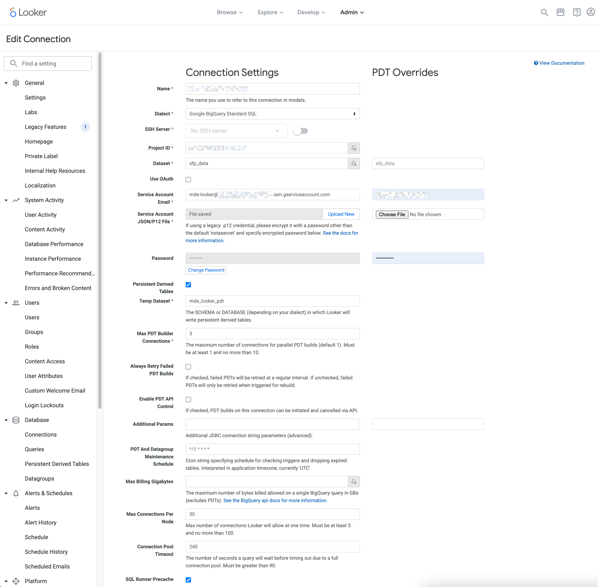

# Machine Learning for Manufacturing LookML

This repository contains LookML model, views, and dashboards for MFG ML.
This is an adaptation of the [Manufacturing Data Engine LookML Template](https://source.cloud.google.com/sfp-solution-external/smart-factory-looker).

## Prerequisites

- An active Looker instance.
- A Looker account with [permissions](https://cloud.google.com/looker/docs/admin-panel-users-roles)
  to:
  - Add database connection to MDE BigQuery tables.
  - Create new LookML projects and setup Git integration.

- An active MDE environment with the latest version.
- A GCP account with [permissions](https://cloud.google.com/iam/docs/understanding-roles)
  to:
  - Create new BigQuery datasets
  - Create new service accounts
  - Assign roles to service accounts

## GCP Setup

1. The LookML model is optimized to use Looker's persistent derived tables (PDT).
   Hence, dedicated dataset for storing the PDT in BigQuery is recommended.
   You can create it in [Cloud Shell](https://cloud.google.com/shell)
   using the code snippet below:

    ```sh
    export LOCATION=US
    export BQ_DATASET_LOOKER_PDT="mde_looker_pdt"
    bq --location=${LOCATION} mk --dataset ${BQ_DATASET_LOOKER_PDT}
    ```

1. A service account with a SA key is required. You can create a service account
   with the required permissions using the code snippet below:

    ```sh
    export PROJECT_ID="customer-mdeproject-h123"
    export SA_LOOKER="mde-looker"
    export SA_LOOKER_EMAIL="${SA_LOOKER}@${PROJECT_ID}.iam.gserviceaccount.com"

    gcloud iam service-accounts create $SA_LOOKER \
      --display-name "MDE Looker account"
    gcloud projects add-iam-policy-binding ${PROJECT_ID} \
      --member serviceAccount:${SA_LOOKER_EMAIL} \
      --role "roles/bigquery.connectionUser"
    gcloud projects add-iam-policy-binding ${PROJECT_ID} \
      --member serviceAccount:${SA_LOOKER_EMAIL} \
      --role "roles/bigquery.dataEditor"
    gcloud projects add-iam-policy-binding ${PROJECT_ID} \
      --member serviceAccount:${SA_LOOKER_EMAIL} \
      --role "roles/bigquery.jobUser"
    gcloud projects add-iam-policy-binding ${PROJECT_ID} \
      --member serviceAccount:${SA_LOOKER_EMAIL} \
      --role "roles/bigtable.user"

    # Creation of SA key
    export SA_LOOKER_KEY=~/projects/$PROJECT_ID/${SA_LOOKER}_key.json
    gcloud iam service-accounts keys create $SA_LOOKER_KEY \
      --iam-account ${SA_LOOKER_EMAIL}


    cat <<EOF
    ===========================================
    Connection credentials to be used in Looker
    ===========================================

    Connection Name: mde
    Project Name: ${PROJECT_ID}
    Dataset: sfp_data
    Dataset PDT: ${BQ_DATASET_LOOKER_PDT}
    Service Account Email: ${SA_LOOKER_EMAIL}
    Service Account JSON File: upload of ${SA_LOOKER_KEY}

    EOF
    ```

1. Create [BigQuery connection](https://cloud.google.com/bigquery/docs/working-with-connections)
   to the MDE Config Manager database.

  ```sh
  export CLOUD_SQL_NAME=$(gcloud sql instances list \
    --filter=name:"imde-config-manager*" \
    --format="value(name)")
  export CLOUD_SQL_REGION=$(gcloud sql instances list \
    --filter=name:"imde-config-manager*" \
    --format="value(region)")
  export CLOUD_SQL_ID="${PROJECT_ID}:${CLOUD_SQL_REGION}:${CLOUD_SQL_NAME}"
  export CLOUD_SQL_PASS=$(gcloud secrets versions access \
    --secret=cloudsql-config-manager-root-password \
    latest)

  gcloud services enable bigqueryconnection.googleapis.com;
  gcloud sql instances patch $CLOUD_SQL_NAME --assign-ip;
  bq mk --connection \
    --display_name='mde-cfg-sql' \
    --connection_type='CLOUD_SQL' \
    --properties="{\"instanceId\":\"${CLOUD_SQL_ID}\",\"database\":\"configuration-manager\",\"type\":\"POSTGRES\"}" \
    --connection_credential="{\"username\":\"root\",\"password\":\"${CLOUD_SQL_PASS}\"}" \
    --project_id=${PROJECT_ID} \
    --location=${LOCATION} \
    mde-cfg-sql
  ```

## Deployment

The deployment of the MFG ML LookML is done in 2 steps:

- Create BigQuery connection in Looker
- Create LookML project and configure Git integration

### Create BigQuery connection in Looker

For setting up the connectivity between Looker and MDE BigQuery,
please follow the [Looker BigQuery documentation](https://cloud.google.com/looker/docs/db-config-google-bigquery).

An example of database connection settings is provided on the screenshot below:



### Create LookML project and configure Git integration

You can deploy the LookML into your Looker instance by:

1. [Creating a new LookML project](https://cloud.google.com/looker/docs/create-projects#creating_a_project)
1. [Cloning this repository](https://cloud.google.com/looker/docs/create-projects#cloning_a_public_git_repository)
1. [Configuring LookML project manifest file](/manifest.lkml)

Once Git integration is configured, you should be able able to access your
MDE dashboards by selecting from the top menu:
**Browse** -> **All Folders** -> **LookML dashboards**

For convenience, it is recommended to [set up a Board](https://cloud.google.com/looker/docs/presenting-content#creating_a_board)
and [pin the MDE LookML dashboards to this Board](https://cloud.google.com/looker/docs/presenting-content#adding_looks_and_dashboards_to_a_board).

## Customization

To customize the LookML, you will have to follow these steps:

1. Fork this repository.
1. [Create a new LookML project](https://cloud.google.com/looker/docs/create-projects#creating_a_project).
1. [Configure Git integration with your forked repository](https://cloud.google.com/looker/docs/setting-up-git-connection).
1. [Use Looker's IDE to customize LookML](https://cloud.google.com/looker/docs/lookml-validation).
